# AWS Databricks Data Analytics Platform - Single Environment Architecture

## Table of Contents
1. [Executive Summary](#executive-summary)
2. [Architecture Overview](#architecture-overview)
3. [Design Principles](#design-principles)
4. [AWS Organization & Identity Management](#aws-organization--identity-management)
5. [Network Architecture](#network-architecture)
6. [Security Architecture](#security-architecture)
7. [Data Architecture](#data-architecture)
8. [Infrastructure as Code](#infrastructure-as-code)
9. [Cost Optimization](#cost-optimization)
10. [Deployment Guide](#deployment-guide)
11. [Monitoring & Operations](#monitoring--operations)
12. [Growth Path](#growth-path)

---

## Executive Summary

This document describes a production-ready, single-account architecture for a data analytics platform built on AWS using Databricks. The design balances simplicity with AWS best practices, providing a secure foundation that can scale as your team grows.

### Key Features:
- **Single AWS account** with AWS Organizations structure for governance
- **Single environment** serving all workloads (dev/test/prod workflows)
- **Single Availability Zone** deployment for cost efficiency
- **AWS Identity Center** for centralized user access management
- **Production-grade security** with simplified operations
- **Infrastructure as Code** using Terraform (managed from GitLab/local)
- **Clear growth path** to multi-account when needed

### Target Audience:
- Small data teams (5-20 people) starting their analytics journey
- Startups wanting professional architecture without complexity
- Teams learning AWS Organizations and governance
- Organizations evaluating Databricks before scaling

### What You'll Build:
- Complete data lake on S3 with Bronze/Silver/Gold layers
- Databricks workspace with Unity Catalog governance
- Secure networking with VPC and cost-optimized endpoints
- Identity management for your team
- Terraform state management for GitLab CI/CD
- Monitoring and cost controls
- All deployed in approximately 1 hour

---

## Architecture Overview

### High-Level Architecture

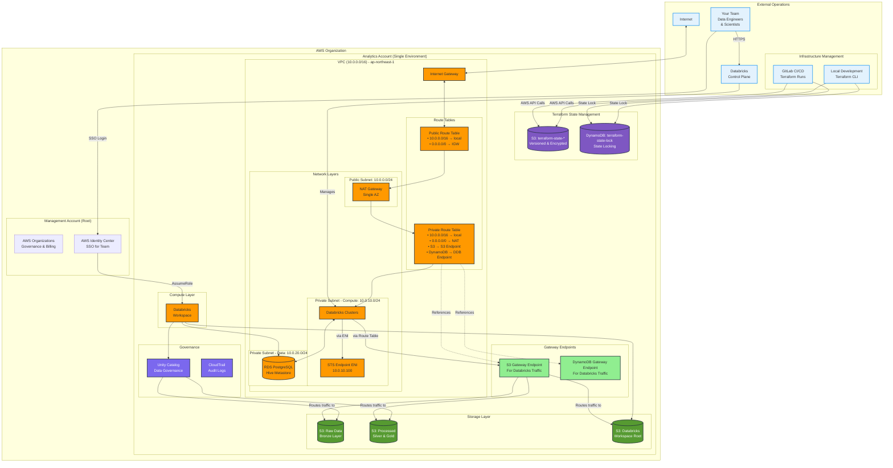

### Component Overview

| Component | Purpose | Why It's Needed |
|-----------|---------|-----------------|
| **AWS Organizations** | Account governance | Practice enterprise patterns, apply SCPs |
| **Identity Center** | User SSO | No IAM users, centralized access |
| **Single VPC** | Network isolation | Security boundary for compute |
| **NAT Gateway** | Outbound internet | Package downloads, API calls |
| **VPC Endpoints** | AWS service access | Free S3/DynamoDB transfer for Databricks |
| **S3 Buckets (4)** | Data lake + Terraform state | Separate raw/processed/workspace/state |
| **Databricks** | Analytics platform | Notebooks, jobs, SQL analytics |
| **RDS PostgreSQL** | Hive metastore | External metastore (optional) |
| **Unity Catalog** | Data governance | Permissions, lineage, discovery |
| **Terraform State** | Infrastructure state | GitLab/local coordination |
| **DynamoDB Table** | State locking | Prevent concurrent modifications |

---

## Design Principles

### 1. Start Simple, Think Big
- Single account reduces complexity by 80%
- AWS Organizations structure ready for expansion
- Modular Terraform enables incremental growth

### 2. Security Without Complexity
- All compute in private subnets
- IAM roles over keys
- Encryption by default
- Single security boundary to manage
- Terraform state encrypted and versioned

### 3. Cost-Conscious Defaults
- Single AZ saves $45/month (NAT Gateway)
- Spot instances for non-critical workloads
- Auto-termination on all clusters
- VPC endpoints eliminate transfer costs for Databricks

### 4. Developer Productivity First
- SSO login (no IAM user juggling)
- Unity Catalog for self-service data access
- Pre-configured cluster policies
- GitLab CI/CD for infrastructure changes
- Clear naming conventions

### 5. Infrastructure as Code Everything
- All resources defined in Terraform
- GitLab pipeline for automated deployments
- State managed centrally in S3
- Version control for all changes

---

## AWS Organization & Identity Management

### Organization Structure with OUs

Even with a single account, creating Organization Units (OUs) provides:
- **Practice with AWS Organizations** hierarchy
- **Different SCP policies** per OU for learning
- **Future-ready structure** for account expansion
- **Governance best practices** from day one

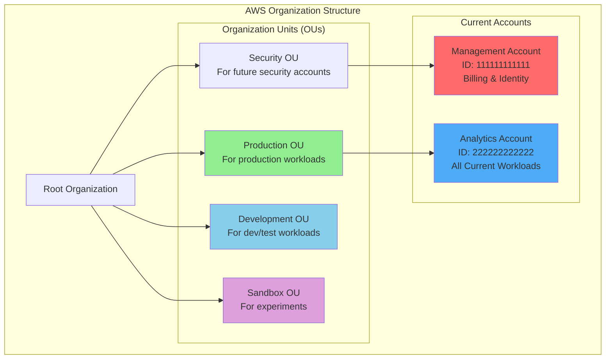

### Organization Unit Strategy Summary

Creating OUs with a single account provides valuable practice and sets up your future growth path:

| OU Name | Current Use | Future Purpose | SCP Focus |
|---------|-------------|----------------|-----------|
| **Security** | Management account only | Security & compliance tools | Restrict to security services |
| **Production** | Analytics account (all workloads) | Production workloads only | Enforce MFA, tagging, single region |
| **Development** | Empty (practice SCP testing) | Dev/test environments | Block expensive resources |
| **Sandbox** | Empty (practice SCP testing) | Personal experiments | Heavy restrictions, small instances |

**Key Benefits**:
1. **Learn OU management** without risk
2. **Test different SCPs** before applying to real accounts
3. **Practice moving accounts** between OUs
4. **Establish governance patterns** early
5. **Document your standards** while team is small

**Remember**: OUs and SCPs have no cost - they're free AWS Organizations features!

### Service Control Policies by OU

Different SCPs for each OU demonstrate policy inheritance and override patterns:

#### 1. Root SCP (Applies to All)
```json
{
  "Version": "2012-10-17",
  "Statement": [
    {
      "Sid": "PreventLeavingOrganization",
      "Effect": "Deny",
      "Action": [
        "organizations:LeaveOrganization",
        "account:CloseAccount"
      ],
      "Resource": "*"
    },
    {
      "Sid": "RequireIMDSv2",
      "Effect": "Deny",
      "Action": "ec2:RunInstances",
      "Resource": "arn:aws:ec2:*:*:instance/*",
      "Condition": {
        "StringNotEquals": {
          "ec2:MetadataHttpTokens": "required"
        }
      }
    }
  ]
}
```

#### 2. Production OU SCP
```json
{
  "Version": "2012-10-17",
  "Statement": [
    {
      "Sid": "DenyUnapprovedRegions",
      "Effect": "Deny",
      "Action": "*",
      "Resource": "*",
      "Condition": {
        "StringNotEquals": {
          "aws:RequestedRegion": ["us-east-1"]
        }
      }
    },
    {
      "Sid": "PreventRootUserActions",
      "Effect": "Deny",
      "Action": "*",
      "Resource": "*",
      "Condition": {
        "StringLike": {
          "aws:PrincipalArn": "arn:aws:iam::*:root"
        }
      }
    },
    {
      "Sid": "RequireMFAForDeletion",
      "Effect": "Deny",
      "Action": [
        "s3:DeleteBucket",
        "rds:DeleteDBInstance",
        "ec2:TerminateInstances"
      ],
      "Resource": "*",
      "Condition": {
        "BoolIfExists": {
          "aws:MultiFactorAuthPresent": "false"
        }
      }
    },
    {
      "Sid": "EnforceStateBackupTags",
      "Effect": "Deny",
      "Action": [
        "s3:CreateBucket",
        "s3:PutObject"
      ],
      "Resource": "arn:aws:s3:::terraform-state-*",
      "Condition": {
        "StringNotEquals": {
          "aws:RequestTag/Terraform": "true",
          "aws:RequestTag/Critical": "true"
        }
      }
    }
  ]
}
```

#### 3. Development OU SCP
```json
{
  "Version": "2012-10-17",
  "Statement": [
    {
      "Sid": "DenyExpensiveInstances",
      "Effect": "Deny",
      "Action": "ec2:RunInstances",
      "Resource": "arn:aws:ec2:*:*:instance/*",
      "Condition": {
        "ForAnyValue:StringEquals": {
          "ec2:InstanceType": [
            "p3.16xlarge",
            "p3dn.24xlarge",
            "x1e.32xlarge",
            "m5.24xlarge"
          ]
        }
      }
    },
    {
      "Sid": "EnforceDevTagging",
      "Effect": "Deny",
      "Action": [
        "ec2:RunInstances",
        "rds:CreateDBInstance"
      ],
      "Resource": "*",
      "Condition": {
        "StringNotEquals": {
          "aws:RequestTag/Environment": "development"
        }
      }
    }
  ]
}
```

#### 4. Sandbox OU SCP
```json
{
  "Version": "2012-10-17",
  "Statement": [
    {
      "Sid": "DenyProductionServices",
      "Effect": "Deny",
      "Action": [
        "rds:*",
        "elasticache:*",
        "es:*",
        "kafka:*"
      ],
      "Resource": "*"
    },
    {
      "Sid": "LimitEC2Size",
      "Effect": "Deny",
      "Action": "ec2:RunInstances",
      "Resource": "arn:aws:ec2:*:*:instance/*",
      "Condition": {
        "ForAnyValue:StringNotLike": {
          "ec2:InstanceType": [
            "t3.*",
            "t2.micro",
            "t2.small"
          ]
        }
      }
    }
  ]
}
```

#### 5. Security OU SCP  
```json
{
  "Version": "2012-10-17",
  "Statement": [
    {
      "Sid": "AllowOnlySecurityServices",
      "Effect": "Deny",
      "NotAction": [
        "cloudtrail:*",
        "config:*",
        "guardduty:*",
        "securityhub:*",
        "access-analyzer:*",
        "iam:*",
        "organizations:Describe*",
        "organizations:List*",
        "s3:*Object*",
        "s3:ListBucket",
        "dynamodb:GetItem",
        "dynamodb:PutItem",
        "dynamodb:DeleteItem"
      ],
      "Resource": "*"
    }
  ]
}
```

### Permission Sets for Single Environment

Since we have one account serving all purposes, permission sets control what users can do:

#### 1. DataPlatformAdmin
**For**: Platform team (1-2 people)
**Purpose**: Full infrastructure management and Terraform execution

```json
{
  "Version": "2012-10-17",
  "Statement": [
    {
      "Effect": "Allow",
      "Action": "*",
      "Resource": "*"
    }
  ]
}
```

Attach AWS Managed Policy: `AdministratorAccess`

#### 2. TerraformDeployer
**For**: CI/CD service account (GitLab runner)
**Purpose**: Infrastructure deployment with least privilege

```json
{
  "Version": "2012-10-17",
  "Statement": [
    {
      "Sid": "TerraformStateAccess",
      "Effect": "Allow",
      "Action": [
        "s3:ListBucket",
        "s3:GetBucketVersioning"
      ],
      "Resource": "arn:aws:s3:::terraform-state-*"
    },
    {
      "Sid": "TerraformStateObjectAccess",
      "Effect": "Allow",
      "Action": [
        "s3:GetObject",
        "s3:PutObject",
        "s3:DeleteObject"
      ],
      "Resource": "arn:aws:s3:::terraform-state-*/*"
    },
    {
      "Sid": "TerraformLockAccess",
      "Effect": "Allow",
      "Action": [
        "dynamodb:PutItem",
        "dynamodb:GetItem",
        "dynamodb:DeleteItem"
      ],
      "Resource": "arn:aws:dynamodb:*:*:table/terraform-state-lock"
    },
    {
      "Sid": "DatabricksInfrastructure",
      "Effect": "Allow",
      "Action": [
        "ec2:*",
        "vpc:*",
        "iam:*",
        "s3:*",
        "rds:*",
        "databricks:*",
        "sts:AssumeRole"
      ],
      "Resource": "*"
    }
  ]
}
```

#### 3. DataEngineer
**For**: Data engineering team (5-7 people)
**Purpose**: Manage data pipelines and Databricks

```json
{
  "Version": "2012-10-17",
  "Statement": [
    {
      "Effect": "Allow",
      "Action": [
        "databricks:*",
        "s3:*",
        "glue:*",
        "athena:*",
        "logs:*",
        "cloudwatch:*",
        "ec2:Describe*",
        "rds:Describe*",
        "iam:GetRole",
        "iam:PassRole",
        "sts:AssumeRole"
      ],
      "Resource": "*"
    },
    {
      "Effect": "Deny",
      "Action": [
        "s3:DeleteBucket",
        "s3:DeleteBucketPolicy",
        "s3:*terraform-state-*",
        "ec2:TerminateInstances",
        "rds:Delete*",
        "iam:CreateAccessKey"
      ],
      "Resource": "*"
    }
  ]
}
```

#### 4. DataAnalyst
**For**: Business analysts and data scientists (5-10 people)
**Purpose**: Use Databricks and query data

```json
{
  "Version": "2012-10-17",
  "Statement": [
    {
      "Effect": "Allow",
      "Action": [
        "databricks:ListClusters",
        "databricks:GetCluster",
        "databricks:*Notebook*",
        "databricks:*Dashboard*",
        "databricks:*Query*",
        "s3:GetObject",
        "s3:ListBucket",
        "athena:*",
        "glue:GetDatabase",
        "glue:GetTable",
        "cloudwatch:GetMetricData"
      ],
      "Resource": "*"
    },
    {
      "Effect": "Allow",
      "Action": "s3:*",
      "Resource": [
        "arn:aws:s3:::*-analytics-sandbox/*/${aws:username}/*"
      ]
    },
    {
      "Effect": "Deny",
      "Action": "*",
      "Resource": [
        "arn:aws:s3:::terraform-state-*",
        "arn:aws:s3:::terraform-state-*/*"
      ]
    }
  ]
}
```

---

## Network Architecture

### VPC Design

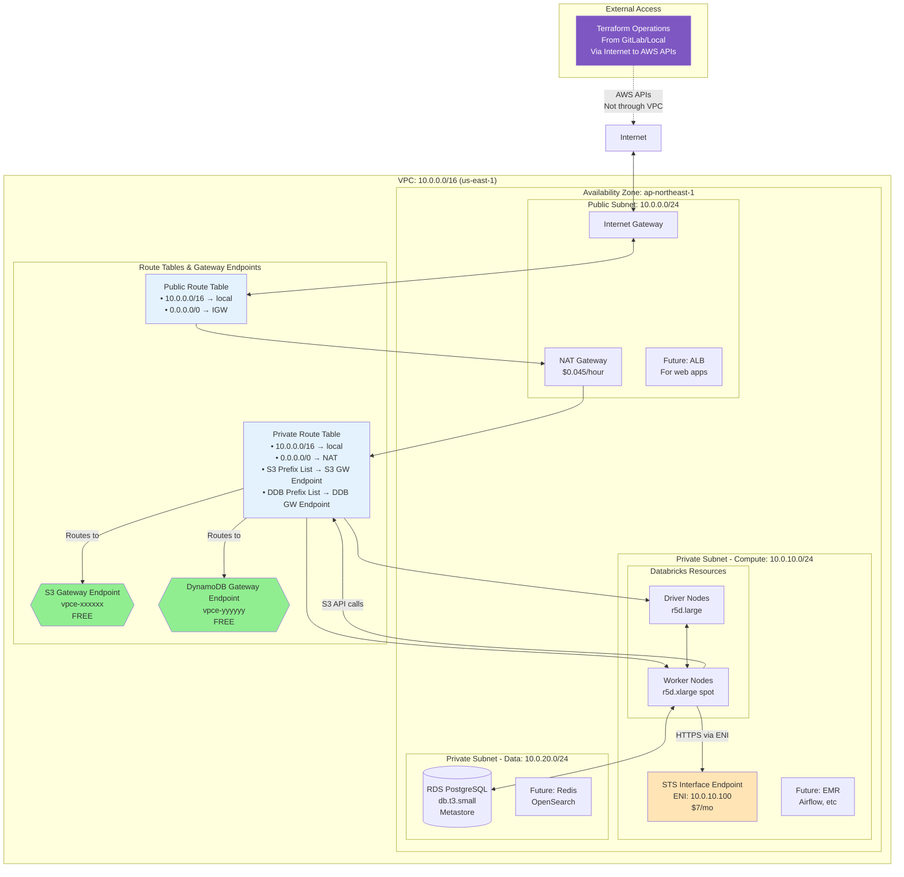

### VPC Endpoints Explained

#### Gateway Endpoints (S3 & DynamoDB)
- **Purpose**: Free data transfer for Databricks clusters accessing S3/DynamoDB
- **Attachment Point**: Route tables (not physical resources)
- **How it works**: Adds routes to your route table that direct S3/DynamoDB traffic to AWS network
- **Cost**: FREE - no data transfer charges
- **Important**: Only benefits traffic from within VPC (Databricks), not external Terraform operations

#### Interface Endpoints (STS, etc.)
- **Purpose**: Private connectivity for Databricks to AWS services
- **Attachment Point**: Creates ENIs in specified subnets
- **How it works**: Private IP addresses in your subnet that proxy requests to AWS services
- **Cost**: $0.01/hour per AZ + data processing charges
- **Configuration**: Select subnets and security groups during creation

### CIDR Planning

```
VPC CIDR: 10.0.0.0/16 (65,534 hosts)

Current Allocation:
├── 10.0.0.0/24   - Public Subnet (254 hosts)
├── 10.0.10.0/24  - Private Compute (254 hosts)
├── 10.0.20.0/24  - Private Data (254 hosts)
└── 10.0.30.0/20  - Reserved for expansion (4,094 hosts)

Future Multi-AZ:
├── 10.0.1.0/24   - Public Subnet AZ-b
├── 10.0.11.0/24  - Private Compute AZ-b
└── 10.0.21.0/24  - Private Data AZ-b
```

### Security Groups Configuration

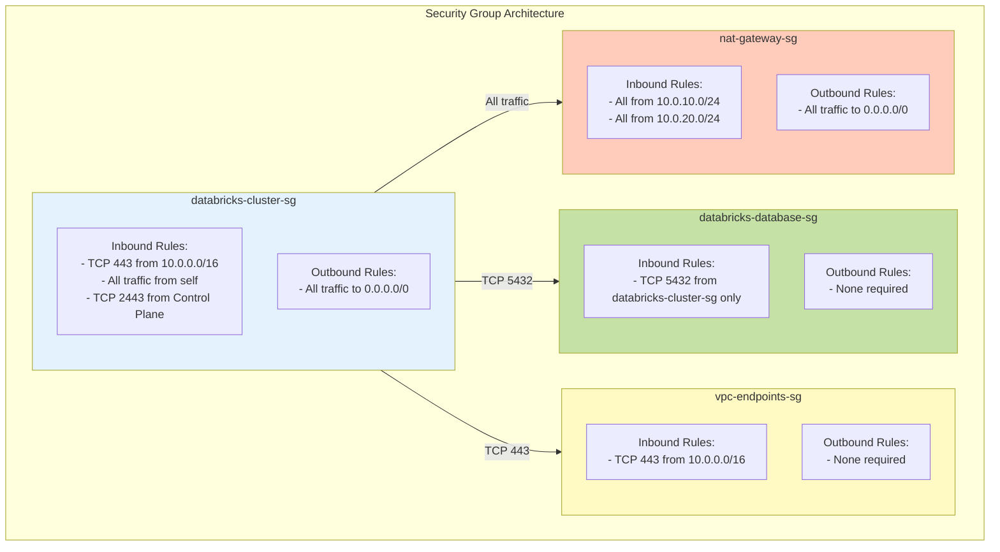

### Detailed Security Group Rules

#### 1. Databricks Cluster Security Group
**Name**: `databricks-cluster-sg`
**Description**: Security group for Databricks compute clusters

```bash
# Inbound Rules
aws ec2 authorize-security-group-ingress \
  --group-id sg-xxxxxxxxx \
  --protocol tcp --port 443 \
  --source-group 10.0.0.0/16 \
  --group-rule-description "HTTPS from VPC"

aws ec2 authorize-security-group-ingress \
  --group-id sg-xxxxxxxxx \
  --protocol all \
  --source-group sg-xxxxxxxxx \
  --group-rule-description "All traffic from self for cluster communication"

aws ec2 authorize-security-group-ingress \
  --group-id sg-xxxxxxxxx \
  --protocol tcp --port 2443 \
  --cidr 52.27.216.188/32 \
  --group-rule-description "Databricks control plane secure cluster connectivity"

# Outbound Rules  
aws ec2 authorize-security-group-egress \
  --group-id sg-xxxxxxxxx \
  --protocol all \
  --cidr 0.0.0.0/0 \
  --group-rule-description "All outbound for package downloads and API calls"
```

#### 2. Database Security Group
**Name**: `databricks-database-sg`
**Description**: Security group for RDS metastore

```bash
# Inbound Rules
aws ec2 authorize-security-group-ingress \
  --group-id sg-yyyyyyyyy \
  --protocol tcp --port 5432 \
  --source-group sg-xxxxxxxxx \
  --group-rule-description "PostgreSQL from Databricks clusters only"

# Outbound Rules - None needed (databases don't initiate connections)
```

#### 3. VPC Endpoints Security Group
**Name**: `vpc-endpoints-sg`
**Description**: Security group for VPC endpoints

```bash
# Inbound Rules
aws ec2 authorize-security-group-ingress \
  --group-id sg-zzzzzzzzz \
  --protocol tcp --port 443 \
  --cidr 10.0.0.0/16 \
  --group-rule-description "HTTPS from VPC for S3 and AWS service access"

# Outbound Rules - None (endpoints don't initiate outbound)
```

### Security Group Best Practices

1. **Principle of Least Privilege**
   - Only open required ports
   - Use security group references over CIDR blocks
   - Avoid 0.0.0.0/0 inbound rules

2. **Naming Conventions**
   ```
   Format: <service>-<component>-sg
   Examples:
   - databricks-cluster-sg
   - databricks-database-sg
   - webapp-alb-sg
   ```

3. **Documentation**
   - Always add descriptions to rules
   - Document why each port is open
   - Include Databricks control plane IPs

4. **Regular Audits**
   ```bash
   # Find overly permissive rules
   aws ec2 describe-security-groups \
     --query 'SecurityGroups[?IpPermissions[?IpRanges[?CidrIp==`0.0.0.0/0`]]].{Name:GroupName,ID:GroupId}' \
     --output table
   ```

---

## Security Architecture

### Security Layers

```mermaid
graph TB
    subgraph "Identity & Access"
        SSO[AWS SSO<br/>No long-lived credentials]
        IAM[IAM Roles<br/>Service permissions]
        UC[Unity Catalog<br/>Data permissions]
        CICD[CI/CD Service Account<br/>Terraform deployments]
    end
    
    subgraph "Network Security"
        VPC[VPC Isolation<br/>Private subnets]
        SG[Security Groups<br/>Micro-segmentation]
        NACL[NACLs<br/>Subnet protection]
    end
    
    subgraph "Data Security"
        S3E[S3 Encryption<br/>SSE-S3 default]
        RDSE[RDS Encryption<br/>At rest]
        TLS[TLS in Transit<br/>All connections]
        TSE[Terraform State<br/>Encrypted & Versioned]
    end
    
    subgraph "Monitoring"
        CT[CloudTrail<br/>API audit logs]
        GD[GuardDuty<br/>Threat detection]
        CW[CloudWatch<br/>Metrics & logs]
    end
    
    SSO --> IAM --> UC
    CICD --> IAM
    VPC --> SG --> NACL
    S3E --> RDSE --> TLS --> TSE
    CT --> GD --> CW
```

### Key IAM Roles

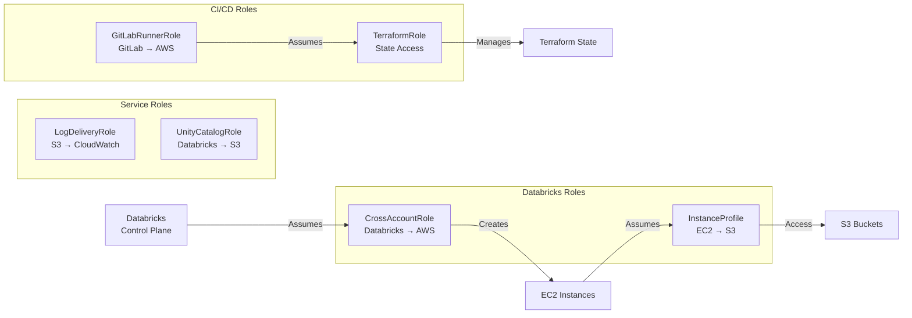

### Encryption Configuration

| Resource | Encryption Type | Key Management | Purpose |
|----------|----------------|----------------|----------|
| S3 Data Buckets | SSE-S3 | AWS Managed | Data at rest |
| S3 Terraform State | SSE-S3 | AWS Managed | Infrastructure state |
| RDS Database | AES-256 | AWS Managed | Metastore |
| EBS Volumes | AES-256 | AWS Managed | Compute storage |
| Network Traffic | TLS 1.2+ | Databricks Managed | In transit |

---

## Data Architecture

### Data Lake Structure

```mermaid
graph TB
    subgraph "S3 Data Lake"
        subgraph "analytics-raw-{account-id}"
            Raw[Bronze Layer<br/>Raw, immutable data]
            RI[/data/<br/>Partitioned by source]
            RA[/archive/<br/>Historical data]
        end
        
        subgraph "analytics-processed-{account-id}"
            Proc[Silver & Gold Layers]
            PS[/silver/<br/>Cleaned, validated]
            PG[/gold/<br/>Business-ready]
            PE[/experiments/<br/>Data science work]
        end
        
        subgraph "analytics-databricks-{account-id}"
            DB[Databricks Root]
            DW[/workspace/<br/>Notebooks, configs]
            DL[/logs/<br/>Cluster logs]
            DT[/tmp/<br/>Temporary data]
        end
        
        subgraph "terraform-state-{account-id}"
            TS[Terraform State]
            TSV[Versioned backups]
            TSL[Access logs]
        end
    end
    
    Raw --> PS
    PS --> PG
    PG --> Reports[BI Tools]
    
    style Raw fill:#CD7F32
    style PS fill:#C0C0C0
    style PG fill:#FFD700
    style TS fill:#7e57c2,color:white
```

### Unity Catalog Structure

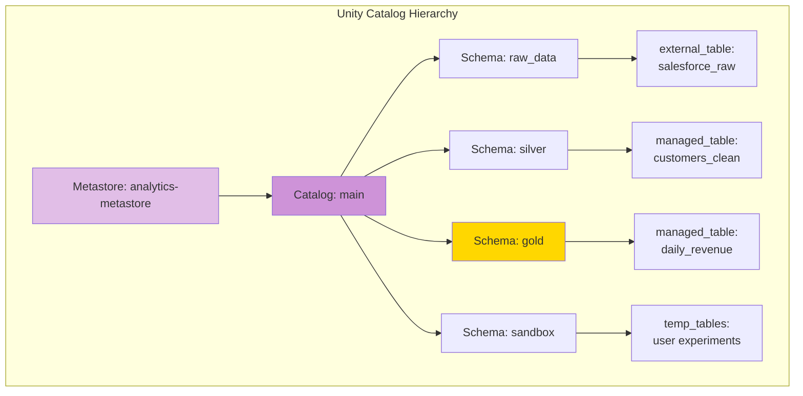

### Sample Unity Catalog Setup

```sql
-- Create catalog and schemas
CREATE CATALOG IF NOT EXISTS main;
USE CATALOG main;

CREATE SCHEMA IF NOT EXISTS raw_data;
CREATE SCHEMA IF NOT EXISTS silver;
CREATE SCHEMA IF NOT EXISTS gold;
CREATE SCHEMA IF NOT EXISTS sandbox;

-- External location for raw data
CREATE EXTERNAL LOCATION IF NOT EXISTS raw_location
URL 's3://analytics-raw-${account_id}/'
WITH (STORAGE CREDENTIAL = 'analytics_credential');

-- Grant permissions
GRANT USAGE ON CATALOG main TO `DataEngineers`;
GRANT CREATE, USAGE ON SCHEMA main.silver TO `DataEngineers`;
GRANT USAGE ON SCHEMA main.gold TO `DataAnalysts`;
GRANT ALL PRIVILEGES ON SCHEMA main.sandbox TO `DataScientists`;

-- Example tables
CREATE OR REPLACE TABLE main.silver.customers (
    customer_id BIGINT,
    name STRING,
    email STRING,
    created_date DATE,
    last_updated TIMESTAMP
) USING DELTA;

CREATE OR REPLACE TABLE main.gold.daily_revenue AS
SELECT 
    date,
    SUM(revenue) as total_revenue,
    COUNT(DISTINCT customer_id) as unique_customers
FROM main.silver.transactions
GROUP BY date;
```

---

## Infrastructure as Code

### Terraform State Management

Since Terraform runs from GitLab CI/CD or local machines (outside the VPC), state management is critical for coordination:

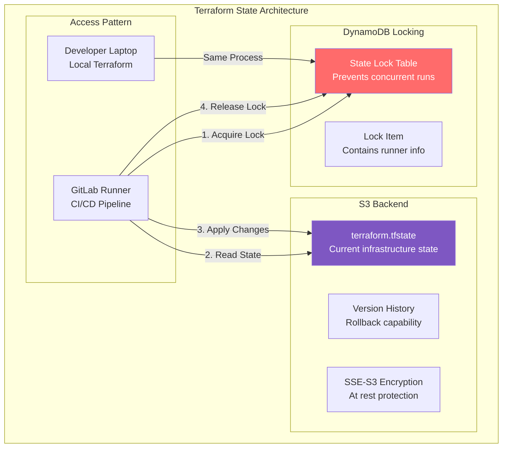

### Terraform Backend Configuration

#### 1. Create State Infrastructure

```hcl
# bootstrap/main.tf - Run this ONCE to create state infrastructure
provider "aws" {
  region = "us-east-1"
}

locals {
  account_id = data.aws_caller_identity.current.account_id
}

data "aws_caller_identity" "current" {}

# S3 bucket for Terraform state
resource "aws_s3_bucket" "terraform_state" {
  bucket = "terraform-state-${local.account_id}"

  lifecycle {
    prevent_destroy = true
  }

  tags = {
    Name        = "Terraform State"
    Environment = "single"
    Terraform   = "true"
    Critical    = "true"
  }
}

# Enable versioning for state history
resource "aws_s3_bucket_versioning" "terraform_state" {
  bucket = aws_s3_bucket.terraform_state.id
  
  versioning_configuration {
    status = "Enabled"
  }
}

# Enable encryption
resource "aws_s3_bucket_server_side_encryption_configuration" "terraform_state" {
  bucket = aws_s3_bucket.terraform_state.id

  rule {
    apply_server_side_encryption_by_default {
      sse_algorithm = "AES256"
    }
  }
}

# Block all public access
resource "aws_s3_bucket_public_access_block" "terraform_state" {
  bucket = aws_s3_bucket.terraform_state.id

  block_public_acls       = true
  block_public_policy     = true
  ignore_public_acls      = true
  restrict_public_buckets = true
}

# S3 bucket policy
resource "aws_s3_bucket_policy" "terraform_state" {
  bucket = aws_s3_bucket.terraform_state.id

  policy = jsonencode({
    Version = "2012-10-17"
    Statement = [
      {
        Sid    = "EnforceTLS"
        Effect = "Deny"
        Principal = "*"
        Action = "s3:*"
        Resource = [
          aws_s3_bucket.terraform_state.arn,
          "${aws_s3_bucket.terraform_state.arn}/*"
        ]
        Condition = {
          Bool = {
            "aws:SecureTransport" = "false"
          }
        }
      }
    ]
  })
}

# DynamoDB table for state locking
resource "aws_dynamodb_table" "terraform_lock" {
  name           = "terraform-state-lock"
  billing_mode   = "PAY_PER_REQUEST"
  hash_key       = "LockID"

  attribute {
    name = "LockID"
    type = "S"
  }

  lifecycle {
    prevent_destroy = true
  }

  tags = {
    Name      = "Terraform State Lock"
    Terraform = "true"
    Critical  = "true"
  }
}

# Output the backend configuration
output "backend_config" {
  value = <<-EOT
    terraform {
      backend "s3" {
        bucket         = "${aws_s3_bucket.terraform_state.id}"
        key            = "databricks-platform/terraform.tfstate"
        region         = "us-east-1"
        encrypt        = true
        dynamodb_table = "${aws_dynamodb_table.terraform_lock.id}"
      }
    }
  EOT
}
```

#### 2. Main Terraform Configuration

```hcl
# main.tf - Main infrastructure code
terraform {
  required_version = ">= 1.0"
  
  backend "s3" {
    bucket         = "terraform-state-${data.aws_caller_identity.current.account_id}"
    key            = "databricks-platform/terraform.tfstate"
    region         = "us-east-1"
    encrypt        = true
    dynamodb_table = "terraform-state-lock"
  }
  
  required_providers {
    aws = {
      source  = "hashicorp/aws"
      version = "~> 5.0"
    }
    databricks = {
      source  = "databricks/databricks"
      version = "~> 1.0"
    }
  }
}
```

### GitLab CI/CD Pipeline

```yaml
# .gitlab-ci.yml
variables:
  TF_VERSION: "1.5.0"
  AWS_REGION: "us-east-1"

stages:
  - validate
  - plan
  - apply

before_script:
  - apk add --no-cache python3 py3-pip
  - pip3 install awscli
  - wget https://releases.hashicorp.com/terraform/${TF_VERSION}/terraform_${TF_VERSION}_linux_amd64.zip
  - unzip terraform_${TF_VERSION}_linux_amd64.zip
  - mv terraform /usr/local/bin/
  - terraform --version

validate:
  stage: validate
  script:
    - cd terraform
    - terraform init -backend=false
    - terraform validate
    - terraform fmt -check=true
  rules:
    - if: '$CI_PIPELINE_SOURCE == "merge_request_event"'

plan:
  stage: plan
  script:
    - cd terraform
    - terraform init
    - terraform plan -out=tfplan
  artifacts:
    paths:
      - terraform/tfplan
    expire_in: 7 days
  rules:
    - if: '$CI_COMMIT_BRANCH == "main"'

apply:
  stage: apply
  script:
    - cd terraform
    - terraform init
    - terraform apply tfplan
  dependencies:
    - plan
  rules:
    - if: '$CI_COMMIT_BRANCH == "main"'
      when: manual
  environment:
    name: production
```

### GitLab Runner AWS Credentials

```yaml
# GitLab CI/CD Variables (set in GitLab UI)
AWS_ACCESS_KEY_ID: "AKIA..."
AWS_SECRET_ACCESS_KEY: "..."
AWS_DEFAULT_REGION: "us-east-1"

# OR use OIDC (recommended)
AWS_ROLE_ARN: "arn:aws:iam::222222222222:role/GitLabRunnerRole"
```

### Local Development Setup

```bash
# ~/.aws/config
[profile databricks-dev]
sso_start_url = https://mycompany.awsapps.com/start
sso_region = us-east-1
sso_account_id = 222222222222
sso_role_name = DataPlatformAdmin
region = us-east-1

# Login via SSO
aws sso login --profile databricks-dev

# Export profile for Terraform
export AWS_PROFILE=databricks-dev

# Run Terraform locally
cd terraform
terraform init
terraform plan
```

---

## Cost Optimization

### Monthly Cost Breakdown

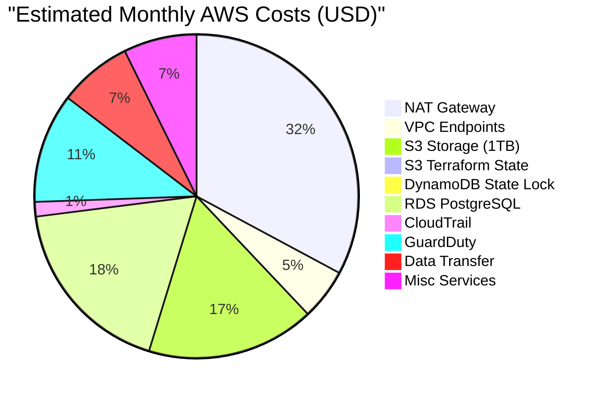

**Total Fixed Costs: ~$139/month**

### Databricks Costs (Variable)

| Workload Type | Instance | DBU/hour | Est. Monthly Cost |
|--------------|----------|----------|-------------------|
| Interactive Dev | r5d.large | 0.55 | $88 (40hr/week) |
| Jobs (Spot) | r5d.xlarge | 0.25 | $40 (8hr/day) |
| SQL Warehouse | Small | 2.00 | $160 (20hr/week) |

**Estimated Databricks: ~$288/month**

**Total Platform Cost: ~$427/month**

### Cost Optimization Strategies

1. **Cluster Policies**
```json
{
  "node_type_id": {
    "type": "allowlist",
    "values": ["r5d.large", "r5d.xlarge", "m5d.large"]
  },
  "autotermination_minutes": {
    "type": "fixed",
    "value": 30
  },
  "spot_bid_max_price": {
    "type": "range",
    "minValue": 50,
    "maxValue": 100
  }
}
```

2. **S3 Lifecycle Rules**
```xml
<LifecycleConfiguration>
    <Rule>
        <Id>ArchiveOldRawData</Id>
        <Status>Enabled</Status>
        <Transition>
            <Days>90</Days>
            <StorageClass>STANDARD_IA</StorageClass>
        </Transition>
        <Transition>
            <Days>365</Days>
            <StorageClass>GLACIER</StorageClass>
        </Transition>
    </Rule>
    <Rule>
        <Id>DeleteOldTerraformVersions</Id>
        <Status>Enabled</Status>
        <NoncurrentVersionExpiration>
            <NoncurrentDays>30</NoncurrentDays>
        </NoncurrentVersionExpiration>
    </Rule>
</LifecycleConfiguration>
```

3. **Automated Cost Alerts**
```python
# CloudWatch alarm for daily spend
alarm = cloudwatch.Alarm(
    name="DailySpendAlert",
    metric_name="EstimatedCharges",
    threshold=20,  # $20/day
    comparison_operator="GreaterThanThreshold",
    alarm_actions=[sns_topic_arn]
)
```

---

## Deployment Guide

### Prerequisites

1. **AWS Account Setup** (30 minutes)
   - Create AWS account with credit card
   - Enable MFA on root account
   - Create admin IAM user for initial setup
   - Enable Cost Explorer and billing alerts

2. **Tool Installation** (10 minutes)
   ```bash
   # macOS
   brew install awscli terraform
   
   # Linux
   curl "https://awscli.amazonaws.com/awscli-exe-linux-x86_64.zip" -o "awscliv2.zip"
   unzip awscliv2.zip && sudo ./aws/install
   
   # Configure AWS CLI
   aws configure
   # Enter: Access Key ID, Secret Access Key, Region (us-east-1), Output (json)
   ```

3. **Databricks Account** (5 minutes)
   - Sign up at [databricks.com](https://databricks.com)
   - Choose AWS as cloud provider
   - Note your Account ID from account console

4. **GitLab Setup** (15 minutes)
   - Create GitLab project for infrastructure
   - Configure CI/CD variables for AWS credentials
   - Set up protected branches for main

### Deployment Steps

#### Step 1: Bootstrap Terraform State
```bash
# First, create the state infrastructure
cd bootstrap
terraform init
terraform plan -out=tfplan
terraform apply tfplan

# Save the backend configuration
terraform output -raw backend_config > ../terraform/backend.tf
```

#### Step 2: Download Starter Kit
```bash
# Clone the repository
git clone https://github.com/your-org/databricks-aws-starter
cd databricks-aws-starter

# Repository structure:
# ├── bootstrap/           # State infrastructure
# │   └── main.tf
# ├── terraform/          # Main infrastructure
# │   ├── main.tf
# │   ├── variables.tf
# │   ├── outputs.tf
# │   └── modules/
# ├── .gitlab-ci.yml      # CI/CD pipeline
# ├── scripts/
# │   ├── setup-org.sh
# │   ├── setup-identity-center.sh
# │   └── validate-deployment.sh
# └── docs/
```

#### Step 3: Configure Variables
```bash
# Copy example variables
cp terraform/terraform.tfvars.example terraform/terraform.tfvars

# Edit with your values
cat > terraform/terraform.tfvars <<EOF
# Project Configuration
project_name = "analytics"
environment = "single"
aws_region = "us-east-1"

# Databricks Configuration
databricks_account_id = "xxxxxxxx-xxxx-xxxx-xxxx-xxxxxxxxxxxx"

# Network Configuration
vpc_cidr = "10.0.0.0/16"
availability_zone = "ap-northeast-1"

# Team Configuration
admin_email = "admin@yourcompany.com"
team_members = [
  "engineer1@yourcompany.com",
  "engineer2@yourcompany.com",
  "analyst1@yourcompany.com"
]

# Cost Controls
enable_spot_instances = true
max_cluster_size = 4
auto_termination_minutes = 30
EOF
```

#### Step 4: Deploy via GitLab (Recommended)
```bash
# Commit your changes
git add terraform/terraform.tfvars
git commit -m "Configure infrastructure variables"
git push origin main

# Pipeline will:
# 1. Validate Terraform configuration
# 2. Create plan and wait for approval
# 3. Apply changes after manual approval

# Monitor in GitLab UI: CI/CD > Pipelines
```

#### Step 5: Deploy Locally (Alternative)
```bash
cd terraform

# Configure AWS SSO (recommended)
aws sso login --profile databricks-dev
export AWS_PROFILE=databricks-dev

# OR use access keys (less secure)
export AWS_ACCESS_KEY_ID="..."
export AWS_SECRET_ACCESS_KEY="..."

# Initialize Terraform
terraform init

# Review deployment plan
terraform plan -out=tfplan

# Deploy (takes ~10 minutes)
terraform apply tfplan

# Save outputs
terraform output -json > ../outputs.json
```

#### Step 6: Configure AWS Organization
```bash
# Run organization setup
../scripts/setup-org.sh

# This script will:
# 1. Create Organization if not exists
# 2. Create Organization Units
# 3. Move accounts to appropriate OUs
# 4. Apply SCP policies
# 5. Enable CloudTrail
```

#### Step 7: Setup Identity Center
```bash
# Configure SSO
../scripts/setup-identity-center.sh

# This will:
# 1. Enable Identity Center
# 2. Create permission sets
# 3. Create groups
# 4. Generate invitation links

# Add users manually in console or via script:
../scripts/add-user.sh "John Doe" john@company.com DataEngineer
```

#### Step 8: Create Databricks Workspace
```bash
# Option 1: Use Databricks CLI
databricks configure --token
databricks workspace create \
  --workspace-name "Analytics Platform" \
  --aws-region us-east-1 \
  --credentials-id $(cat outputs.json | jq -r .credentials_id) \
  --storage-configuration-id $(cat outputs.json | jq -r .storage_config_id) \
  --network-id $(cat outputs.json | jq -r .network_id)

# Option 2: Use AWS Console
# Navigate to Databricks in AWS Marketplace
# Use outputs from terraform for configuration
```

#### Step 9: Validate Deployment
```bash
# Run validation script
../scripts/validate-deployment.sh

# Checklist:
# ✓ Terraform state bucket accessible
# ✓ State locking working
# ✓ VPC and subnets created
# ✓ NAT Gateway active
# ✓ S3 buckets accessible
# ✓ RDS instance running
# ✓ Identity Center accessible
# ✓ Databricks workspace created
# ✓ Can create cluster
# ✓ Unity Catalog enabled
```

### Post-Deployment Setup

1. **Configure Unity Catalog**
   ```sql
   -- In Databricks SQL Editor
   -- Create metastore (if not auto-created)
   CREATE METASTORE IF NOT EXISTS analytics_metastore
   LOCATION 's3://analytics-databricks-${account_id}/metastore';
   
   -- Assign to workspace
   ALTER METASTORE analytics_metastore 
   SET OWNER TO `account admins`;
   ```

2. **Set Up GitLab Schedule**
   ```yaml
   # Schedule weekly infrastructure review
   # GitLab UI: CI/CD > Schedules
   
   # Weekly drift detection
   - Description: "Weekly Terraform Plan"
   - Interval Pattern: "0 9 * * 1"  # Mondays 9am
   - Target Branch: main
   - Variables: TERRAFORM_PLAN_ONLY=true
   ```

3. **Create Sample Data Pipeline**
   ```python
   # In Databricks Notebook
   # Sample ETL pipeline
   
   # Read raw data
   raw_df = spark.read.json("s3://analytics-raw-*/data/sample/")
   
   # Clean and validate (Silver)
   silver_df = raw_df.filter(col("quality_score") > 0.8)
   silver_df.write.mode("overwrite").saveAsTable("main.silver.sample_data")
   
   # Aggregate (Gold)
   gold_df = silver_df.groupBy("category").agg(
       count("*").alias("record_count"),
       avg("value").alias("avg_value")
   )
   gold_df.write.mode("overwrite").saveAsTable("main.gold.category_summary")
   ```

4. **Set Up Monitoring Dashboard**
   - Import CloudWatch dashboard template
   - Configure Databricks workspace alerts
   - Set up cost anomaly detection
   - Monitor Terraform state access

---

## Monitoring & Operations

### Key Metrics Dashboard

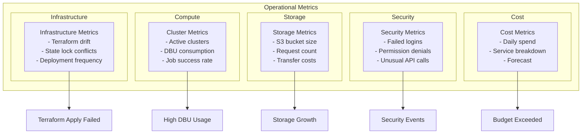

### Infrastructure Monitoring

```python
# Monitor Terraform state access
import boto3
import json
from datetime import datetime, timedelta

def monitor_terraform_state():
    s3 = boto3.client('s3')
    cloudtrail = boto3.client('cloudtrail')
    
    # Check recent state access
    end_time = datetime.now()
    start_time = end_time - timedelta(hours=24)
    
    events = cloudtrail.lookup_events(
        LookupAttributes=[
            {
                'AttributeKey': 'ResourceName',
                'AttributeValue': f'terraform-state-{account_id}'
            }
        ],
        StartTime=start_time,
        EndTime=end_time
    )
    
    # Alert on unusual access patterns
    access_count = {}
    for event in events['Events']:
        user = event.get('Username', 'Unknown')
        access_count[user] = access_count.get(user, 0) + 1
    
    # Check for concurrent state modifications
    state_locks = dynamodb.Table('terraform-state-lock').scan()
    if state_locks['Count'] > 0:
        print("WARNING: Active Terraform locks detected")
        
    return access_count
```

### Maintenance Runbook

| Task | Frequency | Procedure | Automation |
|------|-----------|-----------|------------|
| Review Terraform drift | Weekly | Run `terraform plan` in GitLab | Scheduled pipeline |
| Review CloudTrail logs | Daily | Check for anomalies | Lambda function |
| Update Databricks Runtime | Monthly | Test in dev cluster first | Terraform variable |
| Rotate CI/CD credentials | Quarterly | Update GitLab variables | Calendar reminder |
| Disaster recovery test | Quarterly | Restore from S3 backups | Runbook script |
| Cost optimization review | Monthly | Analyze Cost Explorer | Automated report |
| Security patches | As needed | Apply within 30 days | AWS Systems Manager |
| Clean old state versions | Monthly | S3 lifecycle policy | Automated |

### GitLab Pipeline Monitoring

```yaml
# .gitlab-ci.yml additions for monitoring
notify_slack:
  stage: .post
  script:
    - |
      if [ "$CI_JOB_STATUS" == "failed" ]; then
        curl -X POST $SLACK_WEBHOOK -H 'Content-type: application/json' \
          --data "{\"text\":\"Terraform deployment failed in $CI_COMMIT_REF_NAME\"}"
      fi
  when: on_failure
```

---

## Growth Path

### When to Expand

Consider expansion when you hit these thresholds:

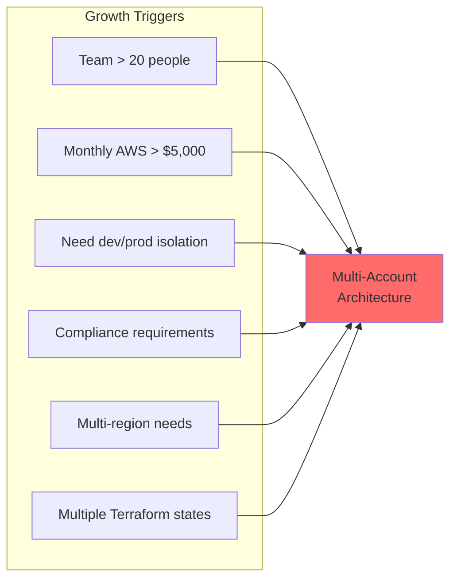

### Migration Path to Multi-Account

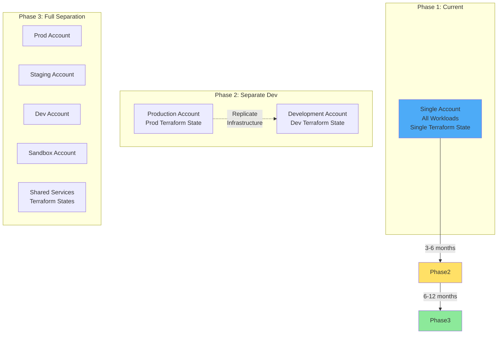

### What Carries Forward

When you expand, these investments remain valuable:

1. **Identity Center setup** - Just add more accounts
2. **Terraform modules** - Reuse for new environments  
3. **Unity Catalog patterns** - Same governance model
4. **Monitoring dashboards** - Aggregate across accounts
5. **GitLab CI/CD** - Add environments and approvals
6. **Team knowledge** - Same tools and patterns

### Expansion Checklist

- [ ] Create separate Terraform state backends per account
- [ ] Update GitLab CI/CD for multi-environment
- [ ] Implement Terraform workspaces or separate repos
- [ ] Create AWS Organizations OU structure
- [ ] Deploy Terraform to new accounts
- [ ] Migrate non-production workloads first
- [ ] Set up cross-account networking (Transit Gateway)
- [ ] Update Identity Center permission sets
- [ ] Enhance monitoring for multiple accounts

---

## Troubleshooting Guide

### Common Issues and Solutions

#### Terraform state lock timeout
```bash
# Check who has the lock
aws dynamodb get-item \
  --table-name terraform-state-lock \
  --key '{"LockID":{"S":"terraform-state-${account_id}/databricks-platform/terraform.tfstate"}}'

# Force unlock (use with caution!)
terraform force-unlock <LOCK_ID>
```

#### GitLab pipeline failures
```yaml
# Debug in pipeline
debug_terraform:
  stage: plan
  script:
    - cd terraform
    - terraform init
    - terraform validate
    - terraform fmt -check=true -diff
    - terraform plan -detailed-exitcode
  when: manual
```

#### Databricks cluster won't start
```bash
# Check IAM role trust policy
aws iam get-role --role-name databricks-cross-account-role

# Verify instance profile
aws iam get-instance-profile --instance-profile-name databricks-instance-profile

# Check VPC endpoints
aws ec2 describe-vpc-endpoints --filters Name=vpc-id,Values=vpc-xxxxx
```

#### High AWS costs
```sql
-- Find expensive Databricks queries
SELECT
  user,
  SUM(dbu_consumed) as total_dbu,
  COUNT(*) as query_count
FROM system.billing.usage
WHERE date >= current_date - 7
GROUP BY user
ORDER BY total_dbu DESC;
```

#### Unity Catalog permissions issues
```sql
-- Check user permissions
SHOW GRANTS TO `user@company.com`;

-- Check schema permissions  
SHOW GRANTS ON SCHEMA main.gold;

-- Grant missing permissions
GRANT SELECT ON SCHEMA main.gold TO `DataAnalysts`;
```

### Support Resources

- **AWS Support**: Available through AWS Console
- **Databricks Support**: support.databricks.com
- **GitLab Support**: about.gitlab.com/support/
- **Community Help**:
  - AWS re:Post
  - Databricks Community Forum
  - Stack Overflow (#databricks, #aws, #terraform)
- **Documentation**:
  - [AWS Databricks Guide](https://docs.databricks.com/administration-guide/cloud-configurations/aws/)
  - [Unity Catalog Docs](https://docs.databricks.com/data-governance/unity-catalog/)
  - [Terraform AWS Provider](https://registry.terraform.io/providers/hashicorp/aws/latest/docs)

---

## Conclusion

This architecture provides a production-ready data platform that can be deployed in approximately one hour. It balances simplicity with best practices, giving you:

- ✅ Secure, single-account setup
- ✅ Identity management with SSO
- ✅ Infrastructure as Code with GitLab CI/CD
- ✅ Cost-optimized infrastructure (~$427/month)
- ✅ Data governance with Unity Catalog
- ✅ Professional state management for Terraform
- ✅ Clear path for growth

### Next Steps

1. **Bootstrap Terraform state** infrastructure first
2. **Set up GitLab** project and CI/CD pipeline
3. **Deploy the infrastructure** using GitLab or locally
4. **Onboard your team** through Identity Center
5. **Load sample data** and create your first pipeline
6. **Set up monitoring** dashboards and alerts
7. **Schedule a review** in 3 months to assess growth needs

Remember: Start simple, measure everything, and expand based on actual requirements. This architecture provides a solid foundation that can grow with your needs while maintaining professional infrastructure practices from day one.

---

*Last Updated: June 15, 2025*
*Version: 2.0*